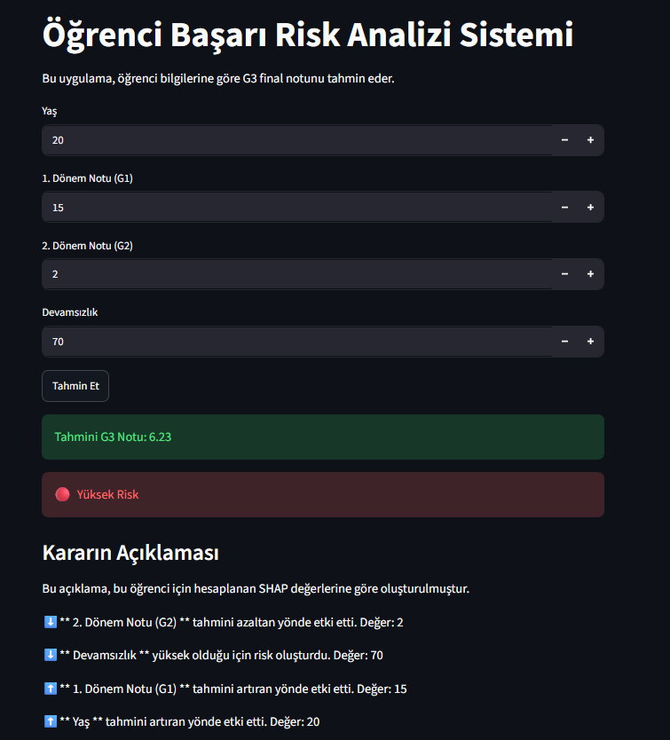
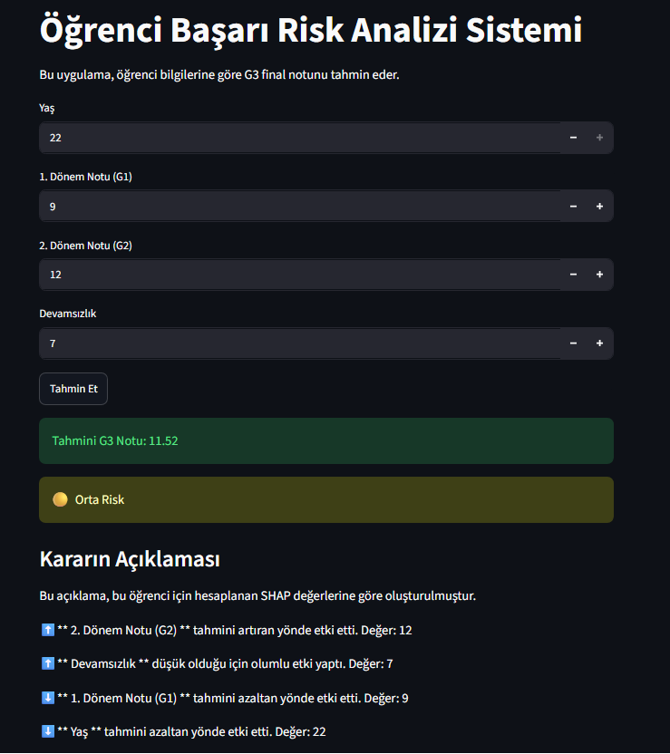
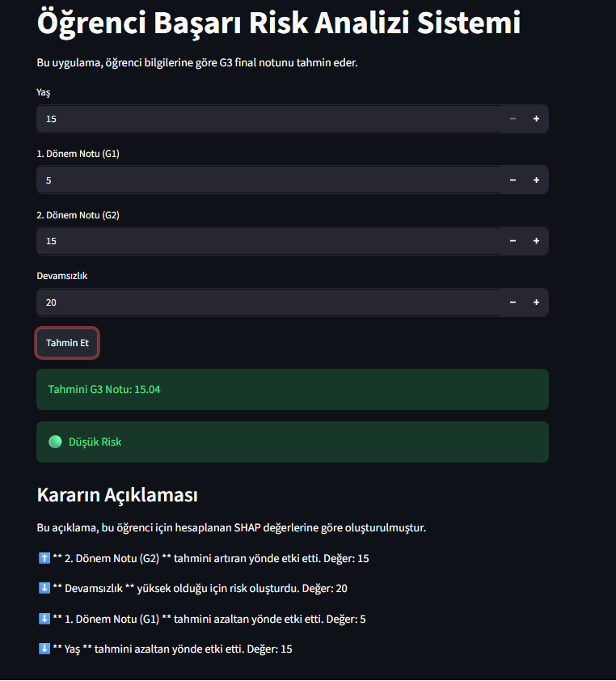

PROJE ADI:
Öğrenci Başarı Risk Analizi Sistemi

PROBLEM TANIMI:
Bu proje, öğrencilerin akademik başarı riskini tahmin etmek amacıyla geliştirilmiştir. Sistem, öğrencinin yaş, dönem notları ve devamsızlık bilgilerini kullanarak G3 final notunu tahmin eder ve risk seviyesini gösterir.

HEDEF KULLANICI:
Öğretmenler, danışmanlar ve ileriki başarısı hakkında farkındalık sahibi olmak isteyen öğrenciler.

ÇÖZÜMÜN KISA AÇIKLAMASI:
Elde edilen veri seti eğitim ve test verisi olarak ikiye ayrılmıştır. Model eğitim verisi üzerinde eğitilmiş, daha sonra test verisi üzerinde değerlendirilmiştir.
Son olarak oluşturulan Streamlit arayüzü sayesinde öğrenci bilgilerini girer. Sistem tahmini G3 notunu, risk seviyesini ve çoğunluğu SHAP tabanlı karar açıklamasını gösterir.

KULLANILAN TEKNOLOJİLER:
- Python
- Pandas
- Scikit-learn (Random Forest Regressor)
- SHAP
- Streamlit
- Matplotlib

SİSTEM İŞ AKIŞI:
1. Veri seti okunur.
2. Eksik veri ve tekrar eden kayıt kontrolü yapılır.
3. Kategorik değişkenler sayısal hale getirilir.
4. Linear Regression ve Random Forest modelleri karşılaştırılır.
5. Daha iyi sonuç veren model arayüzde kullanılır.
6. SHAP ile model kararları açıklanır.
7. Streamlit arayüzü üzerinden tahmin yapılır.

KURULUM:
Gerekli kütüphanelerin yüklenmesi beklenir.

- pip install pandas
- pip install scikit-learn
- pip install streamlit
- pip install shap
- pip install matplotlib

KULLANIM (ÇALIŞTIRMA):
Terminali proje klasöründe açın ve aşağıdaki komutu çalıştırın.

python -m streamlit run 4-Streamlit-interface.py

ÖRNEK EKRAN GÖRÜNTÜLERİ:
### Yüksek Risk ###

### Orta Risk ###

### Düşük Risk ###

TEST SONUÇLARI:
Uygulama farklı öğrenci senaryoları ile test edilmiştir. Düşük, orta ve yüksek risk durumlarında sistem beklenen şekilde tahmin üretmiş ve SHAP açıklamaları sunmuştur.

GELECEKTE YAPILABİLECEK GELİŞTİRMELER:
- Daha büyük veri seti ile model eğitilebilir.
- Daha fazla öğrenci özelliği arayüze eklenebilir.
- Model çevrimiçi olarak yayınlanabilir.
- Daha detaylı SHAP görselleştirmeleri eklenebilir.

VİDEO BAĞLANTISI:
Proje Tanıtım Videosu:
https://drive.google.com/file/d/1GI_8ndePL-QvR2d_gR7mfFXGoyekjkL5/view?usp=sharing

NOT:
Bu çalışmanın yapımında ChatGPT'den yararlanılmıştır.

